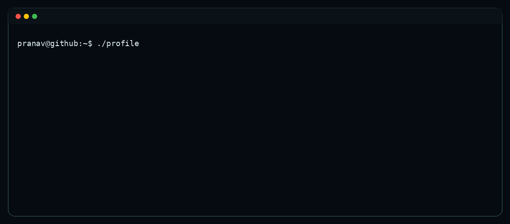
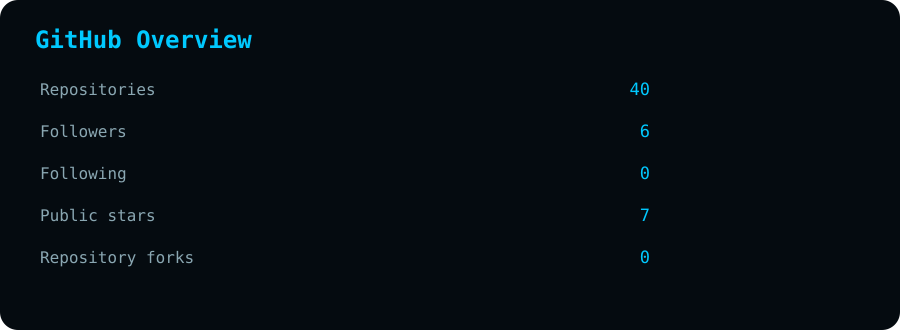
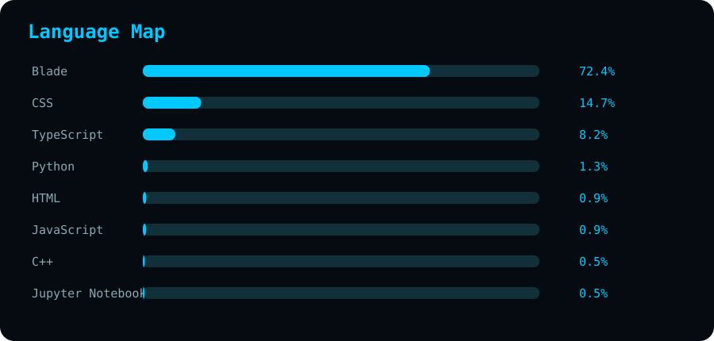
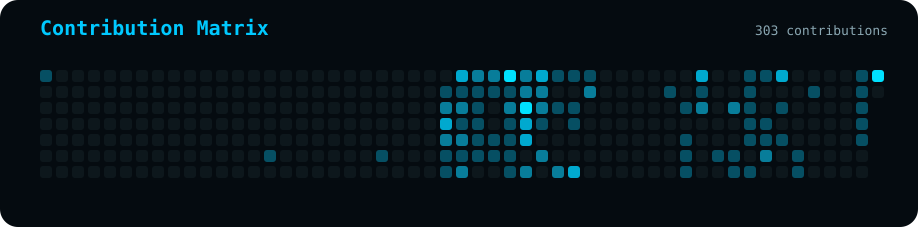

<!-- ========================================================= -->
<!-- PRANAV DHOTE • GITHUB PROFILE                              -->
<!-- ========================================================= -->

<div align="center">

<!-- ⚡ LIVE TERMINAL / ASCII PROFILE -->
<picture>
  <source media="(prefers-color-scheme: dark)" srcset="./assets/neofetch-terminal.gif">
  <source media="(prefers-color-scheme: light)" srcset="./assets/neofetch-terminal.gif">
  
</picture>

<br/>

<a href="https://pranavtdhote.netlify.app/">
  
</a>
<a href="https://www.linkedin.com/in/pranav-dhote-1412b4241">
  
</a>
<a href="https://github.com/pranavtdhote">
  
</a>
<a href="https://pranavtdhote.netlify.app/Pranav_Dhote_Resume.pdf">
  
</a>

</div>

---

## `> whoami`

```yaml
name: Pranav Dhote
role: Full-Stack Engineer
education: B.Tech Information Technology
location: Pune, Maharashtra, India

focus:
  - Full-Stack Engineering
  - AI / GenAI
  - NLP & Intelligent Systems
  - Web3
  - DSA & Core CS

currently:
  building: Production-oriented software
  learning: AI agents + scalable systems
  improving: DSA + system design
  shipping: Real-world projects
```

> **Build practical systems. Learn deeply. Ship consistently.**

---

## `> live.profile`

<div align="center">


</div>

---

## `> github.analytics`

<div align="center">




<br/>



</div>

---

## `> coding.arena`

<div align="center">

<a href="https://leetcode.com/u/pranavtdhote/">
  
</a>
<a href="https://www.codechef.com/users/pranavtdhote">
  
</a>

<br/><br/>


</div>

---

## `> engineering.stack`

<div align="center">

**Languages**


**Frontend**


**Backend & Data**


**AI / Web3 / Tools**


</div>

---

## `> current.focus`

| Area | Status | Direction |
|:---:|:---:|:---|
| 💻 Full Stack | `BUILDING` | Scalable web applications |
| 🧠 AI / GenAI | `BUILDING` | LLMs, agents, NLP |
| ⛓️ Web3 | `EXPLORING` | Smart contracts & decentralized systems |
| 🧩 DSA | `PRACTICING` | Problem solving & interviews |
| 🔬 Research | `EXPLORING` | Intelligent systems & applied AI |

---

## `> selected.work`

<div align="center">

| Project | What it demonstrates |
|:---|:---|
| **AI Financial Intelligence** | GenAI • NLP • Knowledge Graphs |
| **ChainMind Protocol** | AI Agents • Web3 • Trust & Memory |
| **CharityConnect** | React • Solidity • Ethers.js |
| **Flight Reservation** | DBMS • Backend • Data Modeling |

</div>

<p align="center">
  <a href="https://github.com/pranavtdhote?tab=repositories">
    
  </a>
</p>

---

## `> achievements`

<div align="center">


</div>

---

## `> research.interests`

```text
GENERATIVE AI  •  LLMs  •  NLP
MACHINE LEARNING  •  EXPLAINABLE AI
KNOWLEDGE GRAPHS  •  AI AGENTS
CYBERSECURITY  •  INTELLIGENT SYSTEMS
```

---

## `> core.cs`

<div align="center">

`DSA` · `DBMS` · `OS` · `Computer Networks` · `OOP`

</div>

---

## `> system.status`

```text
┌─────────────────────────────────────────────────────────────┐
│                     ENGINEERING STATUS                      │
├─────────────────────────────────────────────────────────────┤
│                                                             │
│  FULL STACK       ████████████████████  ACTIVE             │
│  AI / GENAI       ██████████████████░░  BUILDING           │
│  WEB3             ███████████████░░░░░  EXPLORING          │
│  DSA              ███████████████████░  PRACTICING         │
│  RESEARCH         ████████████████░░░░  EXPLORING          │
│                                                             │
└─────────────────────────────────────────────────────────────┘
```

---

## `> connect`

<div align="center">

<a href="https://pranavtdhote.netlify.app/">Portfolio</a> •
<a href="https://www.linkedin.com/in/pranav-dhote-1412b4241">LinkedIn</a> •
<a href="https://github.com/pranavtdhote">GitHub</a> •
<a href="https://leetcode.com/u/pranavtdhote/">LeetCode</a> •
<a href="https://www.codechef.com/users/pranavtdhote">CodeChef</a>

<br/><br/>

**Build → Break → Learn → Improve → Ship**

<sub>Designed & engineered by Pranav Dhote • Automatically updated with GitHub Actions</sub>

</div>
